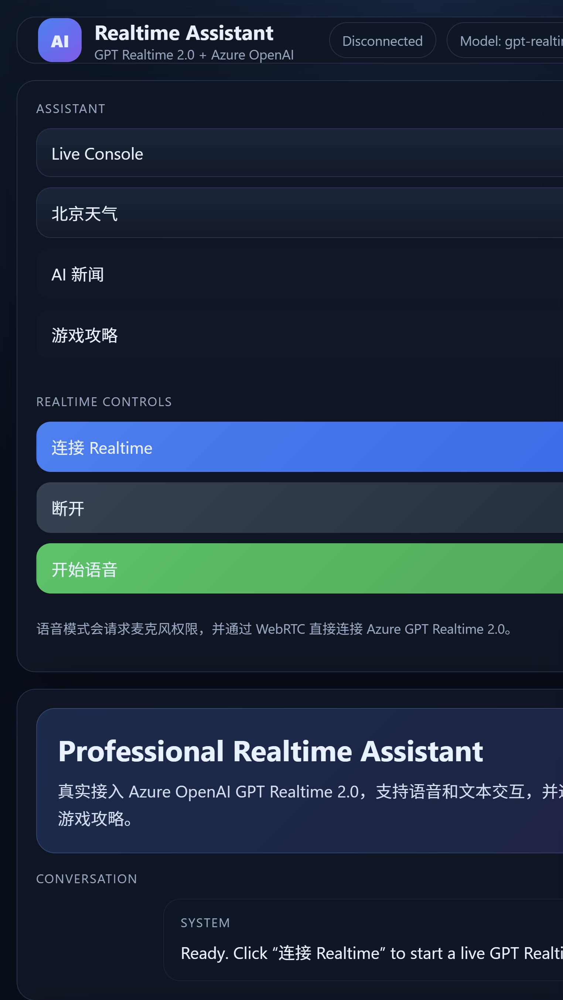

# Voice_Agent_Realtime

一个基于 Azure OpenAI / Azure AI Foundry Realtime API 的浏览器语音助手示例，支持：

- WebRTC 实时语音对话
- 文本输入与回复
- 工具调用增强
- 中文界面和快捷示例

当前内置的工具能力：

- 天气查询
- AI 新闻查询
- 游戏攻略检索

## 界面预览



## 项目结构

```text
.
├── doc/
│   ├── gpt-realtime-2-assistant-solution.md
│   └── realtime-assistant-ui.png
├── public/
│   ├── app.js
│   ├── index.html
│   └── styles.css
├── scripts/
│   └── stop-dev.js
├── .env.example
├── package.json
├── README.md
└── server.js
```

## 安装与启动

安装依赖：

```powershell
npm install
```

复制环境模板：

```powershell
Copy-Item .env.example .env
```

启动服务：

```powershell
npm run dev
```

默认访问地址：

```text
http://127.0.0.1:3210
```

## 环境变量

至少需要配置：

```dotenv
AZURE_OPENAI_RESOURCE=your-resource-name
AZURE_OPENAI_REALTIME_DEPLOYMENT=gpt-realtime-2
```

常用可选项：

```dotenv
AZURE_OPENAI_REALTIME_VOICE=alloy
ASSISTANT_SYSTEM_PROMPT=You are a professional multilingual realtime assistant. Keep answers concise, grounded in tool results, and mention sources when available.
APP_TITLE=Voice_Agent_Realtime
NEWS_API_KEY=
NEWS_API_BASE_URL=https://gnews.io/api/v4
TAVILY_API_KEY=
```

鉴权方式固定为 `DefaultAzureCredential`，不使用 Azure API key 或 OpenAI API key。常见本地准备步骤：

```powershell
az login
az account set --subscription <your-subscription-id>
```

运行身份需要对目标 Azure OpenAI / Foundry 资源具备可用权限。

数据源说明：

- 天气默认使用 Open-Meteo，无需密钥
- 新闻默认使用 Hacker News Search；配置 `NEWS_API_KEY` 后切换为 GNews
- 游戏攻略默认使用 Bing Search RSS；配置 `TAVILY_API_KEY` 后切换为 Tavily

## 使用方式

1. 打开页面后点击“连接 Realtime”
2. 允许浏览器麦克风权限
3. 点击“开始语音”进行语音对话，或直接在底部输入框发送文本
4. 也可以点击左侧快捷入口测试天气、AI 新闻和游戏攻略

示例问题：

- 今天北京天气怎么样
- 给我三条 AI 新闻
- 帮我找一下原神芙宁娜配队攻略

## 实现概览

### Realtime 会话

- 前端通过 `/api/realtime/token` 获取 Azure Realtime client secret
- 后端通过 `DefaultAzureCredential` 申请 `https://ai.azure.com/.default` Bearer token
- 浏览器通过 WebRTC 连接 Azure Realtime GA 接口
- 语音音色读取 `AZURE_OPENAI_REALTIME_VOICE`，由后端配置下发给前端会话

相关接口：

- `/openai/v1/realtime/client_secrets`
- `/openai/v1/realtime/calls`

### Tool Calling

前端在 data channel 中注册三个函数工具：

- `weather_lookup`
- `news_lookup`
- `game_guide_lookup`

当模型触发 function call 时，处理流程如下：

1. 前端接收工具参数
2. 前端请求本地后端工具接口
3. 前端通过 `function_call_output` 把结果回传给 Realtime 会话
4. 模型基于工具结果生成最终答案

后端工具接口：

- `POST /api/tools/weather`
- `POST /api/tools/news`
- `POST /api/tools/game-guide`

## 部署说明

可以直接部署到 Azure Container Apps 或任意支持 Node.js 20+ 的容器环境。最低要求：

- Node.js 20+
- 已部署的 Azure OpenAI / Azure AI Foundry Realtime 模型
- 完整环境变量配置
- 容器或主机环境具备可用的 Azure 身份

## 注意事项

- 如果 Azure 账号未部署 Realtime 模型，连接会失败
- 如果 `DefaultAzureCredential` 无法获取 token，`/api/realtime/token` 会失败
- 浏览器需要允许麦克风权限，建议使用 localhost 或 HTTPS 环境
- Realtime API 仍在快速演进，事件字段和行为可能调整
