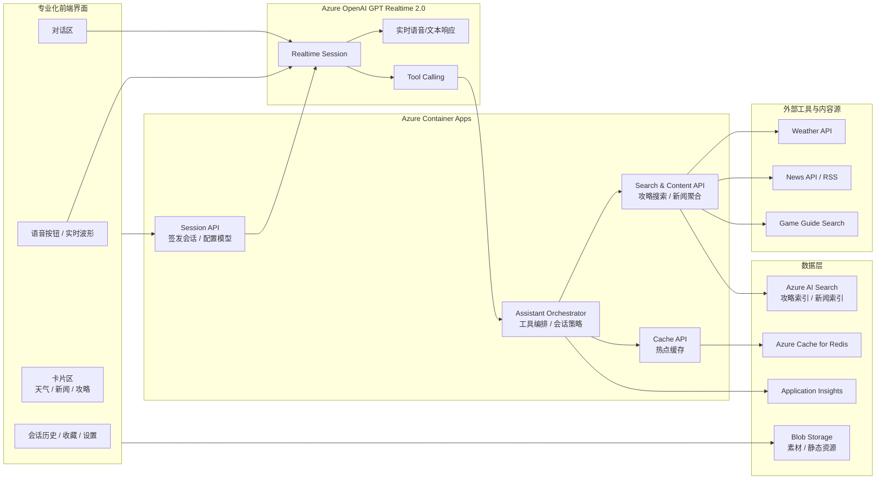
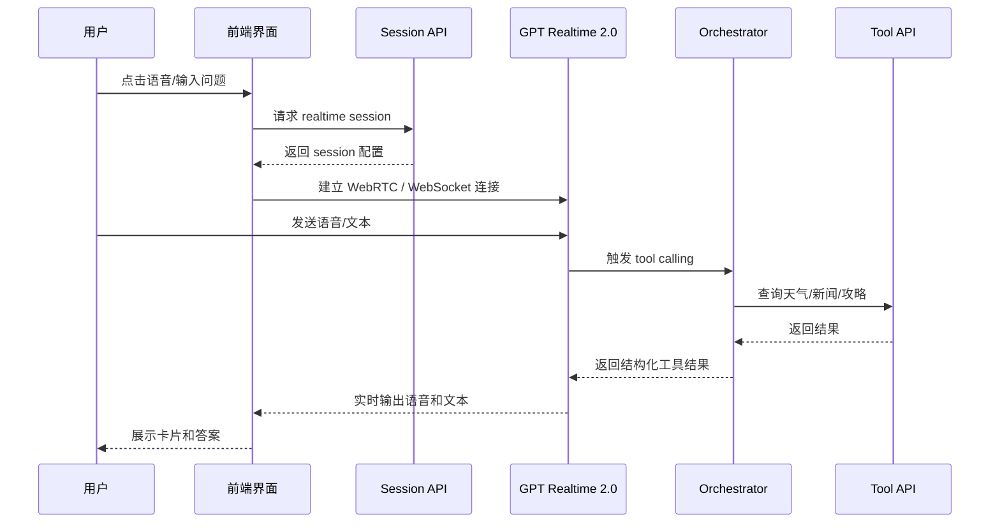
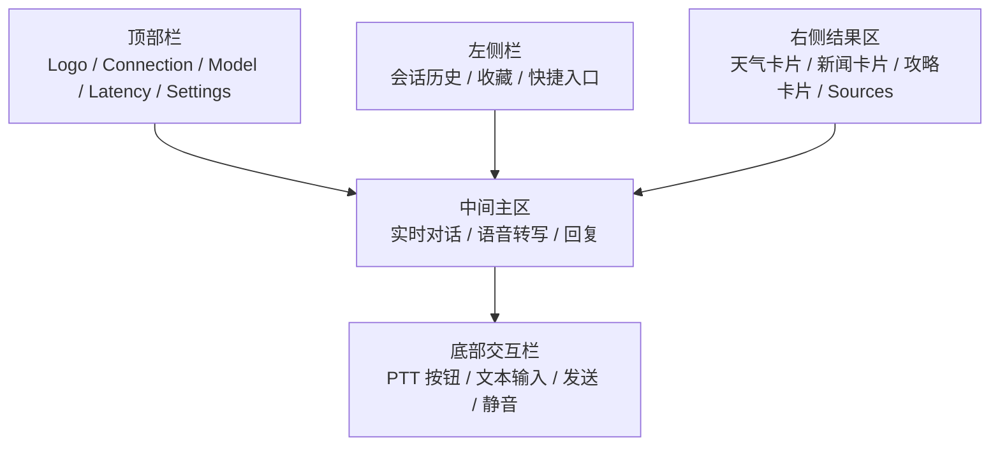

# GPT Realtime 2.0 智能助手方案

## 1. 目标

基于 **Azure OpenAI GPT Realtime 2.0** 构建一个低延迟的智能助手，支持：

- **天气查询**
- **新闻查询**
- **游戏攻略查询**
- **语音和文字双模交互**
- **可部署在 Azure**
- **提供专业化界面**

适合做成一个 **Web 端语音助手** 或 **桌面设备配套控制台**。

---

## 2. 方案定位

推荐采用 **前端实时语音交互 + 云端工具编排 + Azure 托管部署** 的模式：

- 前端负责语音采集、实时播放、界面展示
- GPT Realtime 2.0 负责实时对话、低延迟响应
- 后端负责工具路由、资源聚合、缓存和业务控制
- Azure 负责部署、伸缩、监控

---

## 3. 总体架构

---

## 4. 核心模块设计

### 4.1 前端界面

建议采用 **React / Next.js** 构建，形成一个专业控制台风格界面：

- **顶部栏**：连接状态、当前模型、延迟状态、登录信息
- **左侧导航**：会话历史、收藏内容、快捷入口
- **主对话区**：文本对话、语音转写、AI 回复
- **右侧信息区**：天气卡片、新闻摘要卡片、攻略结果卡片
- **底部交互栏**：按住说话、开始/停止、文本输入框

### 4.2 GPT Realtime 2.0 层

建议使用：

- **WebRTC**：浏览器直连实时语音场景，延迟更低
- **WebSocket**：服务端代理或中间层编排场景

在本方案里：

- 前端通过 **Session API** 获取临时会话配置
- 前端与 GPT Realtime 2.0 建立实时连接
- 模型通过 **Tool Calling** 调用后端能力

### 4.3 工具编排层

通过 Azure Container Apps 承载以下服务：

- **Session API**
  - 负责创建 Realtime 会话
  - 下发模型参数、工具列表、系统提示词

- **Assistant Orchestrator**
  - 管理工具调用
  - 管理查询策略
  - 统一格式化结果

- **Search & Content API**
  - 封装天气、新闻、游戏攻略查询
  - 对外提供稳定的工具接口

- **Cache API**
  - 缓存天气热点结果、头条新闻、热门游戏攻略
  - 降低外部调用成本

### 4.4 查询能力设计

#### 天气查询

- 输入：城市名、当前位置、日期
- 输出：天气摘要、温度、体感、降雨概率、穿衣建议
- 展示：语音播报 + 天气卡片

#### 新闻查询

- 输入：热点新闻、科技新闻、财经新闻、指定主题
- 输出：摘要列表、来源、时间
- 展示：新闻卡片列表 + 语音摘要

#### 游戏攻略查询

推荐做成 **“搜索 + 摘要 + 引用来源”** 模式，而不是直接复制完整攻略内容：

- 支持输入：游戏名、角色名、关卡名、Boss 名、玩法问题
- 后端先检索：
  - 自建攻略索引
  - 官方 Wiki / 官方站点元数据
  - 允许接入的公开内容源
- GPT 基于检索结果做摘要：
  - 推荐阵容
  - 关键步骤
  - 注意事项
  - 引用来源

这样更适合企业和产品化落地，也便于后续扩展。

---

## 5. Azure 资源建议

| 资源 | 用途 |
|---|---|
| Azure OpenAI / Azure AI Foundry | 部署 GPT Realtime 2.0 |
| Azure Container Apps | 承载 Session API、Orchestrator、Tool API |
| Azure AI Search | 建立游戏攻略与新闻索引 |
| Azure Cache for Redis | 热点结果缓存 |
| Azure Blob Storage | 存放静态资源、界面素材 |
| Application Insights | 日志、链路追踪、接口监控 |
| Azure Front Door | 统一入口、加速、证书 |

> 当前 GPT Realtime 2.0 适合优先考虑 **East US 2** 或 **Sweden Central**。

---

## 6. 实时交互流程

---

## 7. 专业界面设计建议

### 7.1 风格

- **深色专业风格**
- 适合 AI 控制台 / 智能助理定位
- 重点突出实时状态、内容卡片和操作效率

### 7.2 页面布局

### 7.3 核心交互

- 实时麦克风波形
- 回复逐步出现
- 工具卡片和语音播报同步
- 新闻、攻略支持点击展开详情
- 攻略结果显示来源标签

---

## 8. Tool 定义建议

可为 Realtime 模型注册以下工具：

### weather_lookup

输入：

- city
- date
- locale

输出：

- summary
- temperature
- feels_like
- rain_probability
- advice

### news_lookup

输入：

- topic
- region
- limit

输出：

- headlines[]
- summaries[]
- sources[]

### game_guide_lookup

输入：

- game
- topic
- character
- stage

输出：

- summary
- steps[]
- tips[]
- sources[]

---

## 9. MVP 建议

第一版建议先做：

1. **语音对话 + 文本对话**
2. **天气查询**
3. **新闻摘要**
4. **游戏攻略搜索与摘要**
5. **专业 Web UI**
6. **Azure Container Apps 部署**

第二版再补：

1. 用户登录
2. 收藏与历史
3. 推荐内容
4. 多语言
5. 个性化游戏偏好

---

## 10. 推荐技术栈

### 前端

- Next.js
- TypeScript
- Tailwind CSS
- WebRTC / WebSocket
- Recharts 或 ECharts（展示趋势或状态）

### 后端

- Node.js / FastAPI
- Azure Container Apps
- Redis
- Azure AI Search

### 模型与工具

- Azure OpenAI GPT Realtime 2.0
- 外部天气 API
- News API / RSS 聚合
- 游戏攻略索引服务

---

## 11. 一句话总结

这是一个基于 **GPT Realtime 2.0 + Azure** 的实时智能助手方案：通过 **专业化前端界面** 提供语音与文字双模交互，通过 **Azure Container Apps** 编排天气、新闻和游戏攻略工具，通过 **Azure AI Search** 和缓存提升内容体验，适合快速落地为一个可演示、可扩展、可部署的专业 AI 助手产品。
