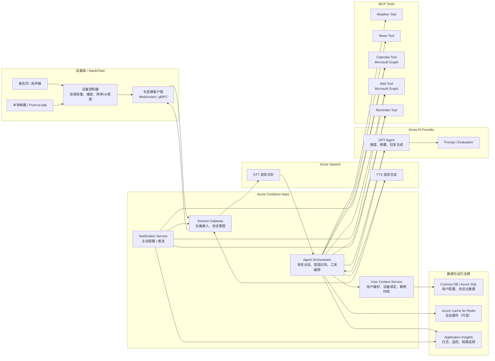

# Voice Agent on Azure 云端集成概要设计

## 1. 方案定位

本方案采用**端侧轻、云端重**的架构：设备端主要负责语音采集、播放、简单状态展示和消息收发；核心 AI 能力、工具编排、用户上下文管理、Mail/Calendar 打通以及主动通知均部署在 Azure 云端。

目标能力包括：

- 天气查询
- 日历查询
- 新闻查询
- 重要事项主动通知
- Mail / Calendar 打通

云端核心能力基于：

- Azure AI Foundry
- Azure AI Speech
- GPT + MCP Tool Calling
- Azure Container Apps

## 2. Mermaid 架构图

## 3. 模块说明

### 3.1 设备端

设备端仅承担轻量职责：

- 音频采集与播放
- 本地唤醒或按键触发
- 简单 UI / 表情 / 状态灯
- 与云端建立长连接，接收主动通知

### 3.2 Azure Speech

- **STT**：将设备端语音转为文本
- **TTS**：将云端回复转为自然语音返回设备端

### 3.3 Azure Container Apps

- **Session Gateway**：负责设备接入、会话管理
- **Agent Orchestrator**：负责多轮上下文、意图识别、GPT 调用与工具编排
- **Notification Service**：负责重要邮件、会议、提醒事项的主动触达
- **User Context Service**：管理用户偏好、静默时间、设备绑定关系

### 3.4 Azure AI Foundry

- 承载 GPT Agent 推理
- 管理 Prompt、模型和评测
- 支撑天气、新闻、日历、邮件等场景的统一对话体验

### 3.5 MCP Tools

- **Weather Tool**：天气查询
- **News Tool**：新闻检索与摘要
- **Calendar Tool**：访问 Calendar，查询用户日程
- **Mail Tool**：访问 Mail，抽取重点邮件并生成摘要
- **Reminder Tool**：生成和触发提醒任务

## 4. 典型业务流程

### 4.1 查询类场景

用户语音请求先经过 Azure Speech 转写，再由 Agent Orchestrator 调用 GPT 判断意图；如需外部数据，则通过 MCP Tool 调用天气、新闻、邮件或日历服务；结果经 GPT 组织成自然语言，再通过 TTS 返回设备播放。

### 4.2 主动通知场景

Notification Service 定时检查用户日历、邮件和提醒事项。当识别到高优先级信息或即将开始的重要会议时，通过设备长连接主动推送播报内容，并可在屏幕上同步展示卡片信息。

## 5. 设计特点

- **端侧轻量**：适合算力有限设备
- **云端智能集中化**：便于快速升级模型和工具能力
- **能力可扩展**：后续可继续增加 ToDo、Teams、知识库、IoT 控制等能力
- **易于平台化扩展**：后续可继续补充账号体系、安全和治理能力

## 6. 一句话总结

这是一个以 **Azure 云端 Agent** 为核心、以设备为语音入口和通知终端的桌面 AI 助手方案：通过 **Azure Speech** 处理语音、**Azure AI Foundry** 承载 GPT Agent、**MCP Tools** 对接天气/新闻/Graph、**Azure Container Apps** 托管编排与通知服务，实现查询类能力和 Mail/Calendar 驱动的主动通知能力。
