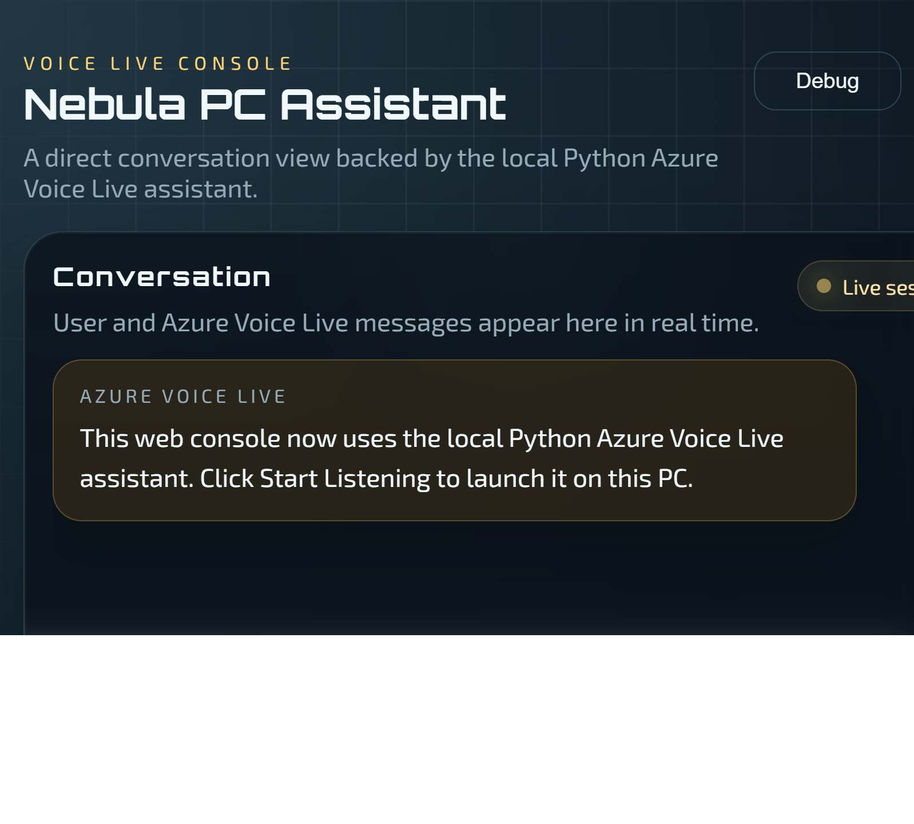

# Voice_Agent_VoiceLive

一个运行在 Windows 本机上的 Azure Voice Live 助手项目，提供浏览器控制台和本地 Python 助手两套协同能力。界面名称为 Nebula PC Assistant，项目侧重本地设备控制、摄像头理解，以及中文语音指令联动。

## 界面预览



## 主要能力

- 浏览器前端控制台展示实时对话、运行状态和调试信息。
- Node.js 服务提供静态页面和本地 HTTP API。
- Python 模块负责执行 Windows 音量控制、桌面动作和摄像头分析。
- Azure Voice Live 助手支持中文语音指令，并可调用浏览器最近三帧的摄像头分析结果。
- 内置天气和新闻查询工具，回答优先基于实时工具结果。

典型指令示例：

- `把音量调到 30`
- `静音`
- `取消静音`
- `现在音量是多少`
- `打开计算器`
- `打开记事本`
- `打开资源管理器`
- `打开设置`
- `显示桌面`
- `打开摄像头并开始观察`
- `北京今天天气怎么样`
- `帮我看一下 AI 相关新闻`

## 项目结构

```text
.
├── docs/
│   └── nebula-pc-assistant-console.png
├── pc_assistant/
│   ├── scripts/
│   ├── src/
│   ├── .env.example
│   ├── README.md
│   ├── requirements-audio.txt
│   └── requirements.txt
├── src/
│   └── main.js
├── index.html
├── package-lock.json
├── package.json
├── README.md
├── server.js
└── styles.css
```

## 运行前提

1. Windows 10/11。
2. Node.js 18+。
3. Python 3.10-3.12，推荐 Python 3.12 x64。
4. 可访问系统默认音频设备。
5. 如果要使用摄像头画面理解，需要一个支持图片输入的 Azure Foundry 或 Inference 模型部署。

## 安装与启动

安装 Node.js 依赖：

```powershell
npm install
```

安装 Python 依赖：

```powershell
cd .\pc_assistant
py -3.12 -m venv .venv
.\.venv\Scripts\Activate.ps1
python -m pip install -U pip
pip install -r requirements.txt
cd ..
```

如果你还要启用带麦克风输入的 Voice Live 语音助手，再额外安装：

```powershell
cd .\pc_assistant
pip install -r requirements-audio.txt
cd ..
```

启动服务：

```powershell
npm start
```

默认访问地址：

```text
http://localhost:3000
```

`server.js` 会优先使用 `pc_assistant/.venv/Scripts/python.exe`；如果该虚拟环境不存在，则回退到系统 `python`。

## HTTP API

### `GET /api/volume`

读取当前系统音量状态。

### `POST /api/volume`

设置系统音量。

请求体示例：

```json
{
  "level": 45
}
```

### `POST /api/mute`

设置静音状态。

请求体示例：

```json
{
  "muted": true
}
```

### `POST /api/windows/action`

触发一个可见的 Windows 桌面动作。

请求体示例：

```json
{
  "action": "open_calculator"
}
```

当前支持的动作：

- `open_calculator`
- `open_notepad`
- `open_explorer`
- `open_settings`
- `show_desktop`

### `POST /api/camera/analyze`

分析浏览器本地缓存中的最近几帧摄像头画面。

当前前端默认发送最近 3 帧组成的 `imageDataUrls`，最后一张是当前最新画面；服务端也兼容单张字段 `imageDataUrl`。

请求体示例：

```json
{
  "imageDataUrls": [
    "data:image/jpeg;base64,...",
    "data:image/jpeg;base64,...",
    "data:image/jpeg;base64,..."
  ],
  "prompt": "请简洁描述当前摄像头画面中的主要内容。"
}
```

## 环境变量

`pc_assistant/.env.example` 提供了 Voice Live 和视觉模型相关的模板配置。常用变量包括：

- `AZURE_VOICELIVE_ENDPOINT`
- `AZURE_VOICELIVE_MODEL`
- `AZURE_VOICELIVE_VOICE`
- `AZURE_VISION_ENDPOINT`
- `AZURE_VISION_MODEL`
- `ASSISTANT_INSTRUCTIONS`

摄像头分析接口还支持从 `AZURE_INFERENCE_ENDPOINT` 与 `AZURE_INFERENCE_MODEL` 读取多模态模型配置。

## Voice Live 助手

如果你还想单独运行命令行版 Azure Voice Live 助手，请查看：

- `pc_assistant/README.md`

这个入口更适合需要 Azure 实时语音对话、function calling 和本地设备控制联动的场景。

## 注意事项

- 天气默认通过 Open-Meteo 获取。
- 新闻优先通过 GDELT 获取，失败时回退到 Hacker News。
- `gpt-realtime` 这类实时语音模型不适合做稳定的摄像头画面理解，建议把视觉分析单独指向支持图像输入的多模态部署。
- 当前仓库没有覆盖音量控制 API、摄像头分析链路或 Voice Live 助手流程的自动化测试，提交前更适合做一次本机手动验证。
